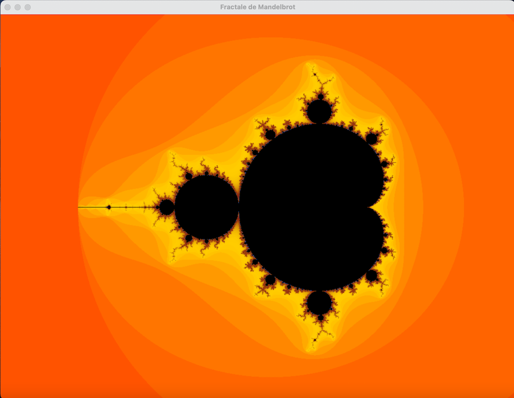

# Mandelbrot

This program display the Mandelbrot set. Left click to zoom in, right click to zoom out 

## Requirements

This program requires the SDL 2 library. Install it before building.

## Credits
This script use colorgrad github.com/mazznoer/colorgrad for generating color gradients
and go-sdl2  github.com/veandco/go-sdl2/sdl
